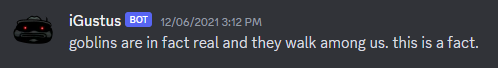
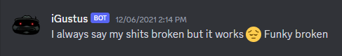
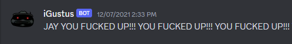

### Introduction

---

<a href="https://discord.com/" target="_blank">Discord</a>, for those of you who may not know, is a widely used platform for text, voice, and video communication. One of its standout features is the availability of an API that allows developers to create applications that integrate with Discord. On top of that, Discord offers the ability to develop bots capable of direct interaction with a server's users. These bots can perform a wide array of tasks, from server management and automation to facilitating games and much more.

### So What Did I Build?

---

Back in late 2021, before ChatGPT became a household name and the AI revolution gained widespread recognition, my journey into the AI began with a fun application called A.I Dungeon.

At that time, like many others, I found myself heavily reliant on Discord thanks to Covid. I used it both to keep in touch with friends and as an integral part of my university courses, which was used for project management and collaboration.

To keep myself from going insane in isolation, I decided to keep myself busy by working on a project that combined these two aspects: Discord and AI.
The idea was simple really: train some AI models using the text data from my friends, and develop a bot to interact with these models.

### How Did I Build It?

---

For this project, I developed a bot that had the ability to extract the text messages from a few private servers that my friends and I were a part of. With this data, I trained an AI model using <a href="https://openai.com/api/" target="_blank">OpenAI's GPT-3 API</a>.

I didn't stop at just one model though; instead, I got _very_ carried away and trained several distinct models, each with their own unique "personalities". These included:

1. **_The Everything Model:_**<br/>This model was trained using the entirety of my friend's text messages, resulting in a very unhinged conversationalist.
2. **_The Friend Fusion Models:_**<br/>These models were crafted using data from a specific combination of friends.
3. **_Literary Fusion Models:_**<br/>These models were further iterations on the models above. They were fusions of texts from friends and excerpts from various literary sources, consisting of sources such as: The Bible, a collection of all of Donald Trump's tweets.

With this, we could specify the desired personality with a specific command to begin interacting with it. All you had to do was use the `/{PERSONALITY}` command, followed by an optional prompt, i.e.

```bash
/igustus Hello there!
```

### The Nitty Gritty Technical Details

---

#### **What I built it with:**

I wrote the bot using <a href="https://go.dev" target="_blank">The Go Programming Language</a>, and <a href="https://github.com/bwmarrin/discordgo" target="_blank">DiscordGo</a>; a package that provides low level bindings to the Discord chat client API.

I chose Go simply because I was already familiar with the language, and I enjoy working with it!

#### **Text Data Extraction & Data Processing:**

I built the data extraction directly into the bot by implementing a `/scrape` command. This command queries the Discord API for all data in the text channel it was issued in, with optional user IDs to filter by. This data was parsed into CSV and saved to the filesystem of my local machine.

There were a few annoying things to work around here, mainly the fact that you could only request up to 100 messages from a channel per request, so I had to keep a reference to the last message's ID and pass that in as an index to the next request to the Discord API.

#### **OpenAI GPT-3 Integration**:

To train the models I used a CLI Tool provided by OpenAI. All I had to do was provide a file path to the CSV file of the data I wanted to train it with.

To actually interact with the models and OpenAI's API, I used an unofficial Go client to make the API calls and handle parsing the API's response data into a Go struct.

### Wrapping Up

---

This project was great fun to build, and was even more enjoyable to interact with. Here a few personal favourite responses:




There is absolutely room for improvement in many areas of this project, and I would love to revisit this some day! However, unfortunately all good things must come to an end (i.e I ran out of free OpenAI API credits), so this project now resides in my side-project graveyard.

The source for this project can be found <a href="https://github.com/Jaytpa01/iGustus" target="_blank">here</a> if you'd like to have a little geez!
